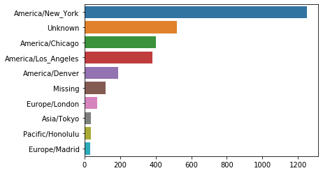
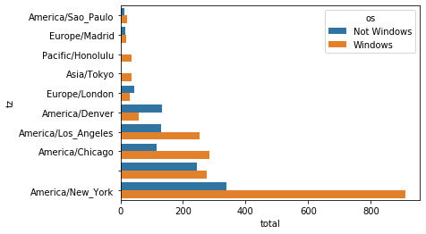
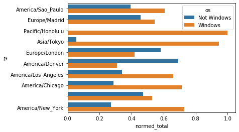

# Analysis from USA.got dataset from Bitly

This dataset provide a feed of anonymous data gathered from usets who shorten links ending with _**.gov**_ or _**.mil**_. This dataset is a JSON.

## Most often-occurring time zones

Because the dataset came in a JSON, we will use json library.


```python
import json
```


```python
path = 'datasets/data.txt'
```


```python
records = [json.loads(line) for line in open(path)]
```


```python
records[0]
```


    {'a': 'Mozilla/5.0 (Windows NT 6.1; WOW64) AppleWebKit/535.11 (KHTML, like Gecko) Chrome/17.0.963.78 Safari/535.11',
     'c': 'US',
     'nk': 1,
     'tz': 'America/New_York',
     'gr': 'MA',
     'g': 'A6qOVH',
     'h': 'wfLQtf',
     'l': 'orofrog',
     'al': 'en-US,en;q=0.8',
     'hh': '1.usa.gov',
     'r': 'http://www.facebook.com/l/7AQEFzjSi/1.usa.gov/wfLQtf',
     'u': 'http://www.ncbi.nlm.nih.gov/pubmed/22415991',
     't': 1331923247,
     'hc': 1331822918,
     'cy': 'Danvers',
     'll': [42.576698, -70.954903]}


### Counting Time Zones with Pandas


```python
import pandas as pd
```


```python
frame = pd.DataFrame(records)
```


```python
frame.info()
```

    <class 'pandas.core.frame.DataFrame'>
    RangeIndex: 3560 entries, 0 to 3559
    Data columns (total 18 columns):
     #   Column       Non-Null Count  Dtype  
    ---  ------       --------------  -----  
     0   a            3440 non-null   object 
     1   c            2919 non-null   object 
     2   nk           3440 non-null   float64
     3   tz           3440 non-null   object 
     4   gr           2919 non-null   object 
     5   g            3440 non-null   object 
     6   h            3440 non-null   object 
     7   l            3440 non-null   object 
     8   al           3094 non-null   object 
     9   hh           3440 non-null   object 
     10  r            3440 non-null   object 
     11  u            3440 non-null   object 
     12  t            3440 non-null   float64
     13  hc           3440 non-null   float64
     14  cy           2919 non-null   object 
     15  ll           2919 non-null   object 
     16  _heartbeat_  120 non-null    float64
     17  kw           93 non-null     object 
    dtypes: float64(4), object(14)
    memory usage: 500.8+ KB


```python
frame.head(10)
```


<div>
<style scoped>
    .dataframe tbody tr th:only-of-type {
        vertical-align: middle;
    }

    .dataframe tbody tr th {
        vertical-align: top;
    }

    .dataframe thead th {
        text-align: right;
    }
</style>
<table border="1" class="dataframe">
  <thead>
    <tr style="text-align: right;">
      <th></th>
      <th>a</th>
      <th>c</th>
      <th>nk</th>
      <th>tz</th>
      <th>gr</th>
      <th>g</th>
      <th>h</th>
      <th>l</th>
      <th>al</th>
      <th>hh</th>
      <th>r</th>
      <th>u</th>
      <th>t</th>
      <th>hc</th>
      <th>cy</th>
      <th>ll</th>
      <th>_heartbeat_</th>
      <th>kw</th>
    </tr>
  </thead>
  <tbody>
    <tr>
      <th>0</th>
      <td>Mozilla/5.0 (Windows NT 6.1; WOW64) AppleWebKi...</td>
      <td>US</td>
      <td>1.0</td>
      <td>America/New_York</td>
      <td>MA</td>
      <td>A6qOVH</td>
      <td>wfLQtf</td>
      <td>orofrog</td>
      <td>en-US,en;q=0.8</td>
      <td>1.usa.gov</td>
      <td>http://www.facebook.com/l/7AQEFzjSi/1.usa.gov/...</td>
      <td>http://www.ncbi.nlm.nih.gov/pubmed/22415991</td>
      <td>1.331923e+09</td>
      <td>1.331823e+09</td>
      <td>Danvers</td>
      <td>[42.576698, -70.954903]</td>
      <td>NaN</td>
      <td>NaN</td>
    </tr>
    <tr>
      <th>1</th>
      <td>GoogleMaps/RochesterNY</td>
      <td>US</td>
      <td>0.0</td>
      <td>America/Denver</td>
      <td>UT</td>
      <td>mwszkS</td>
      <td>mwszkS</td>
      <td>bitly</td>
      <td>NaN</td>
      <td>j.mp</td>
      <td>http://www.AwareMap.com/</td>
      <td>http://www.monroecounty.gov/etc/911/rss.php</td>
      <td>1.331923e+09</td>
      <td>1.308262e+09</td>
      <td>Provo</td>
      <td>[40.218102, -111.613297]</td>
      <td>NaN</td>
      <td>NaN</td>
    </tr>
    <tr>
      <th>2</th>
      <td>Mozilla/4.0 (compatible; MSIE 8.0; Windows NT ...</td>
      <td>US</td>
      <td>1.0</td>
      <td>America/New_York</td>
      <td>DC</td>
      <td>xxr3Qb</td>
      <td>xxr3Qb</td>
      <td>bitly</td>
      <td>en-US</td>
      <td>1.usa.gov</td>
      <td>http://t.co/03elZC4Q</td>
      <td>http://boxer.senate.gov/en/press/releases/0316...</td>
      <td>1.331923e+09</td>
      <td>1.331920e+09</td>
      <td>Washington</td>
      <td>[38.9007, -77.043098]</td>
      <td>NaN</td>
      <td>NaN</td>
    </tr>
    <tr>
      <th>3</th>
      <td>Mozilla/5.0 (Macintosh; Intel Mac OS X 10_6_8)...</td>
      <td>BR</td>
      <td>0.0</td>
      <td>America/Sao_Paulo</td>
      <td>27</td>
      <td>zCaLwp</td>
      <td>zUtuOu</td>
      <td>alelex88</td>
      <td>pt-br</td>
      <td>1.usa.gov</td>
      <td>direct</td>
      <td>http://apod.nasa.gov/apod/ap120312.html</td>
      <td>1.331923e+09</td>
      <td>1.331923e+09</td>
      <td>Braz</td>
      <td>[-23.549999, -46.616699]</td>
      <td>NaN</td>
      <td>NaN</td>
    </tr>
    <tr>
      <th>4</th>
      <td>Mozilla/5.0 (Windows NT 6.1; WOW64) AppleWebKi...</td>
      <td>US</td>
      <td>0.0</td>
      <td>America/New_York</td>
      <td>MA</td>
      <td>9b6kNl</td>
      <td>9b6kNl</td>
      <td>bitly</td>
      <td>en-US,en;q=0.8</td>
      <td>bit.ly</td>
      <td>http://www.shrewsbury-ma.gov/selco/</td>
      <td>http://www.shrewsbury-ma.gov/egov/gallery/1341...</td>
      <td>1.331923e+09</td>
      <td>1.273672e+09</td>
      <td>Shrewsbury</td>
      <td>[42.286499, -71.714699]</td>
      <td>NaN</td>
      <td>NaN</td>
    </tr>
    <tr>
      <th>5</th>
      <td>Mozilla/5.0 (Windows NT 6.1; WOW64) AppleWebKi...</td>
      <td>US</td>
      <td>0.0</td>
      <td>America/New_York</td>
      <td>MA</td>
      <td>axNK8c</td>
      <td>axNK8c</td>
      <td>bitly</td>
      <td>en-US,en;q=0.8</td>
      <td>bit.ly</td>
      <td>http://www.shrewsbury-ma.gov/selco/</td>
      <td>http://www.shrewsbury-ma.gov/egov/gallery/1341...</td>
      <td>1.331923e+09</td>
      <td>1.273673e+09</td>
      <td>Shrewsbury</td>
      <td>[42.286499, -71.714699]</td>
      <td>NaN</td>
      <td>NaN</td>
    </tr>
    <tr>
      <th>6</th>
      <td>Mozilla/5.0 (Windows NT 5.1) AppleWebKit/535.1...</td>
      <td>PL</td>
      <td>0.0</td>
      <td>Europe/Warsaw</td>
      <td>77</td>
      <td>wcndER</td>
      <td>zkpJBR</td>
      <td>bnjacobs</td>
      <td>pl-PL,pl;q=0.8,en-US;q=0.6,en;q=0.4</td>
      <td>1.usa.gov</td>
      <td>http://plus.url.google.com/url?sa=z&amp;n=13319232...</td>
      <td>http://www.nasa.gov/mission_pages/nustar/main/...</td>
      <td>1.331923e+09</td>
      <td>1.331923e+09</td>
      <td>Luban</td>
      <td>[51.116699, 15.2833]</td>
      <td>NaN</td>
      <td>NaN</td>
    </tr>
    <tr>
      <th>7</th>
      <td>Mozilla/5.0 (Windows NT 6.1; rv:2.0.1) Gecko/2...</td>
      <td>None</td>
      <td>0.0</td>
      <td></td>
      <td>NaN</td>
      <td>wcndER</td>
      <td>zkpJBR</td>
      <td>bnjacobs</td>
      <td>bg,en-us;q=0.7,en;q=0.3</td>
      <td>1.usa.gov</td>
      <td>http://www.facebook.com/</td>
      <td>http://www.nasa.gov/mission_pages/nustar/main/...</td>
      <td>1.331923e+09</td>
      <td>1.331923e+09</td>
      <td>NaN</td>
      <td>NaN</td>
      <td>NaN</td>
      <td>NaN</td>
    </tr>
    <tr>
      <th>8</th>
      <td>Opera/9.80 (X11; Linux zbov; U; en) Presto/2.1...</td>
      <td>None</td>
      <td>0.0</td>
      <td></td>
      <td>NaN</td>
      <td>wcndER</td>
      <td>zkpJBR</td>
      <td>bnjacobs</td>
      <td>en-US, en</td>
      <td>1.usa.gov</td>
      <td>http://www.facebook.com/l.php?u=http%3A%2F%2F1...</td>
      <td>http://www.nasa.gov/mission_pages/nustar/main/...</td>
      <td>1.331923e+09</td>
      <td>1.331923e+09</td>
      <td>NaN</td>
      <td>NaN</td>
      <td>NaN</td>
      <td>NaN</td>
    </tr>
    <tr>
      <th>9</th>
      <td>Mozilla/5.0 (Windows NT 6.1; WOW64) AppleWebKi...</td>
      <td>None</td>
      <td>0.0</td>
      <td></td>
      <td>NaN</td>
      <td>zCaLwp</td>
      <td>zUtuOu</td>
      <td>alelex88</td>
      <td>pt-BR,pt;q=0.8,en-US;q=0.6,en;q=0.4</td>
      <td>1.usa.gov</td>
      <td>http://t.co/o1Pd0WeV</td>
      <td>http://apod.nasa.gov/apod/ap120312.html</td>
      <td>1.331923e+09</td>
      <td>1.331923e+09</td>
      <td>NaN</td>
      <td>NaN</td>
      <td>NaN</td>
      <td>NaN</td>
    </tr>
  </tbody>
</table>
</div>


```python
frame['tz'][:10]
```


    0     America/New_York
    1       America/Denver
    2     America/New_York
    3    America/Sao_Paulo
    4     America/New_York
    5     America/New_York
    6        Europe/Warsaw
    7                     
    8                     
    9                     
    Name: tz, dtype: object


```python
tz_counts = frame['tz'].value_counts()
```

### Count all Time Zones


```python
tz_counts[:10]
```


    America/New_York       1251
                            521
    America/Chicago         400
    America/Los_Angeles     382
    America/Denver          191
    Europe/London            74
    Asia/Tokyo               37
    Pacific/Honolulu         36
    Europe/Madrid            35
    America/Sao_Paulo        33
    Name: tz, dtype: int64


```python
clean_tz = frame['tz'].fillna('Missing')
```


```python
clean_tz[clean_tz == ''] = 'Unknown'
```


```python
tz_counts = clean_tz.value_counts()
```


```python
tz_counts[:10]
```


    America/New_York       1251
    Unknown                 521
    America/Chicago         400
    America/Los_Angeles     382
    America/Denver          191
    Missing                 120
    Europe/London            74
    Asia/Tokyo               37
    Pacific/Honolulu         36
    Europe/Madrid            35
    Name: tz, dtype: int64


## Plot observations

Now we can see the most often-occurring time zones


```python
import seaborn as sns
```


```python
subset = tz_counts[:10]
```


```python
sns.barplot(y=subset.index, x=subset.values)
```


    <matplotlib.axes._subplots.AxesSubplot at 0x7fc91d45cc10>





### ¿What OS use the users?


```python
frame['a'][1]
```


    'GoogleMaps/RochesterNY'


```python
frame['a'][50]
```


    'Mozilla/5.0 (Windows NT 5.1; rv:10.0.2) Gecko/20100101 Firefox/10.0.2'


```python
frame['a'][51][:50]
```


    'Mozilla/5.0 (Linux; U; Android 2.2.2; en-us; LG-P9'


```python
results = pd.Series([x.split()[0] for x in frame.a.dropna()])
```


```python
results[:5]
```


    0               Mozilla/5.0
    1    GoogleMaps/RochesterNY
    2               Mozilla/4.0
    3               Mozilla/5.0
    4               Mozilla/5.0
    dtype: object


```python
results.value_counts()[:8]
```


    Mozilla/5.0                 2594
    Mozilla/4.0                  601
    GoogleMaps/RochesterNY       121
    Opera/9.80                    34
    TEST_INTERNET_AGENT           24
    GoogleProducer                21
    Mozilla/6.0                    5
    BlackBerry8520/5.0.0.681       4
    dtype: int64


```python
import numpy as np
```


```python
cframe = frame[frame.a.notnull()]
```


```python
cframe['os'] = np.where(cframe['a'].str.contains('Windows'), 'Windows', 'Not Windows')
```

    /opt/anaconda3/lib/python3.7/site-packages/ipykernel_launcher.py:1: SettingWithCopyWarning: 
    A value is trying to be set on a copy of a slice from a DataFrame.
    Try using .loc[row_indexer,col_indexer] = value instead
    
    See the caveats in the documentation: https://pandas.pydata.org/pandas-docs/stable/user_guide/indexing.html#returning-a-view-versus-a-copy
      """Entry point for launching an IPython kernel.


```python
cframe['os'][:5]
```


    0        Windows
    1    Not Windows
    2        Windows
    3    Not Windows
    4        Windows
    Name: os, dtype: object


```python
by_tz_os = cframe.groupby(['tz', 'os'])
```


```python
agg_counts = by_tz_os.size().unstack().fillna(0)
```


```python
agg_counts[:10]
```


<div>
<style scoped>
    .dataframe tbody tr th:only-of-type {
        vertical-align: middle;
    }

    .dataframe tbody tr th {
        vertical-align: top;
    }

    .dataframe thead th {
        text-align: right;
    }
</style>
<table border="1" class="dataframe">
  <thead>
    <tr style="text-align: right;">
      <th>os</th>
      <th>Not Windows</th>
      <th>Windows</th>
    </tr>
    <tr>
      <th>tz</th>
      <th></th>
      <th></th>
    </tr>
  </thead>
  <tbody>
    <tr>
      <th></th>
      <td>245.0</td>
      <td>276.0</td>
    </tr>
    <tr>
      <th>Africa/Cairo</th>
      <td>0.0</td>
      <td>3.0</td>
    </tr>
    <tr>
      <th>Africa/Casablanca</th>
      <td>0.0</td>
      <td>1.0</td>
    </tr>
    <tr>
      <th>Africa/Ceuta</th>
      <td>0.0</td>
      <td>2.0</td>
    </tr>
    <tr>
      <th>Africa/Johannesburg</th>
      <td>0.0</td>
      <td>1.0</td>
    </tr>
    <tr>
      <th>Africa/Lusaka</th>
      <td>0.0</td>
      <td>1.0</td>
    </tr>
    <tr>
      <th>America/Anchorage</th>
      <td>4.0</td>
      <td>1.0</td>
    </tr>
    <tr>
      <th>America/Argentina/Buenos_Aires</th>
      <td>1.0</td>
      <td>0.0</td>
    </tr>
    <tr>
      <th>America/Argentina/Cordoba</th>
      <td>0.0</td>
      <td>1.0</td>
    </tr>
    <tr>
      <th>America/Argentina/Mendoza</th>
      <td>0.0</td>
      <td>1.0</td>
    </tr>
  </tbody>
</table>
</div>


```python
indexer = agg_counts.sum(1).argsort()
```


```python
indexer[:10]
```


    tz
                                      24
    Africa/Cairo                      20
    Africa/Casablanca                 21
    Africa/Ceuta                      92
    Africa/Johannesburg               87
    Africa/Lusaka                     53
    America/Anchorage                 54
    America/Argentina/Buenos_Aires    57
    America/Argentina/Cordoba         26
    America/Argentina/Mendoza         55
    dtype: int64


```python
count_subset = agg_counts.take(indexer[-10:])
```


```python
count_subset
```


<div>
<style scoped>
    .dataframe tbody tr th:only-of-type {
        vertical-align: middle;
    }

    .dataframe tbody tr th {
        vertical-align: top;
    }

    .dataframe thead th {
        text-align: right;
    }
</style>
<table border="1" class="dataframe">
  <thead>
    <tr style="text-align: right;">
      <th>os</th>
      <th>Not Windows</th>
      <th>Windows</th>
    </tr>
    <tr>
      <th>tz</th>
      <th></th>
      <th></th>
    </tr>
  </thead>
  <tbody>
    <tr>
      <th>America/Sao_Paulo</th>
      <td>13.0</td>
      <td>20.0</td>
    </tr>
    <tr>
      <th>Europe/Madrid</th>
      <td>16.0</td>
      <td>19.0</td>
    </tr>
    <tr>
      <th>Pacific/Honolulu</th>
      <td>0.0</td>
      <td>36.0</td>
    </tr>
    <tr>
      <th>Asia/Tokyo</th>
      <td>2.0</td>
      <td>35.0</td>
    </tr>
    <tr>
      <th>Europe/London</th>
      <td>43.0</td>
      <td>31.0</td>
    </tr>
    <tr>
      <th>America/Denver</th>
      <td>132.0</td>
      <td>59.0</td>
    </tr>
    <tr>
      <th>America/Los_Angeles</th>
      <td>130.0</td>
      <td>252.0</td>
    </tr>
    <tr>
      <th>America/Chicago</th>
      <td>115.0</td>
      <td>285.0</td>
    </tr>
    <tr>
      <th></th>
      <td>245.0</td>
      <td>276.0</td>
    </tr>
    <tr>
      <th>America/New_York</th>
      <td>339.0</td>
      <td>912.0</td>
    </tr>
  </tbody>
</table>
</div>


```python
agg_counts.sum(1).nlargest(10)
```


    tz
    America/New_York       1251.0
                            521.0
    America/Chicago         400.0
    America/Los_Angeles     382.0
    America/Denver          191.0
    Europe/London            74.0
    Asia/Tokyo               37.0
    Pacific/Honolulu         36.0
    Europe/Madrid            35.0
    America/Sao_Paulo        33.0
    dtype: float64


```python
count_subset = count_subset.stack()
```


```python
count_subset.name = 'total'
```


```python
count_subset = count_subset.reset_index()
```


```python
count_subset[:10]
```


<div>
<style scoped>
    .dataframe tbody tr th:only-of-type {
        vertical-align: middle;
    }

    .dataframe tbody tr th {
        vertical-align: top;
    }

    .dataframe thead th {
        text-align: right;
    }
</style>
<table border="1" class="dataframe">
  <thead>
    <tr style="text-align: right;">
      <th></th>
      <th>tz</th>
      <th>os</th>
      <th>total</th>
    </tr>
  </thead>
  <tbody>
    <tr>
      <th>0</th>
      <td>America/Sao_Paulo</td>
      <td>Not Windows</td>
      <td>13.0</td>
    </tr>
    <tr>
      <th>1</th>
      <td>America/Sao_Paulo</td>
      <td>Windows</td>
      <td>20.0</td>
    </tr>
    <tr>
      <th>2</th>
      <td>Europe/Madrid</td>
      <td>Not Windows</td>
      <td>16.0</td>
    </tr>
    <tr>
      <th>3</th>
      <td>Europe/Madrid</td>
      <td>Windows</td>
      <td>19.0</td>
    </tr>
    <tr>
      <th>4</th>
      <td>Pacific/Honolulu</td>
      <td>Not Windows</td>
      <td>0.0</td>
    </tr>
    <tr>
      <th>5</th>
      <td>Pacific/Honolulu</td>
      <td>Windows</td>
      <td>36.0</td>
    </tr>
    <tr>
      <th>6</th>
      <td>Asia/Tokyo</td>
      <td>Not Windows</td>
      <td>2.0</td>
    </tr>
    <tr>
      <th>7</th>
      <td>Asia/Tokyo</td>
      <td>Windows</td>
      <td>35.0</td>
    </tr>
    <tr>
      <th>8</th>
      <td>Europe/London</td>
      <td>Not Windows</td>
      <td>43.0</td>
    </tr>
    <tr>
      <th>9</th>
      <td>Europe/London</td>
      <td>Windows</td>
      <td>31.0</td>
    </tr>
  </tbody>
</table>
</div>


Number of OS use by users


```python
sns.barplot(x='total', y='tz', hue='os', data=count_subset)
```


    <matplotlib.axes._subplots.AxesSubplot at 0x7fc91dbe7710>





### OS users normalizad by group


```python
def norm_total(group):
    group['normed_total'] = group.total / group.total.sum()
    return group
```


```python
results = count_subset.groupby('tz').apply(norm_total)
```


```python
results.head()
```


<div>
<style scoped>
    .dataframe tbody tr th:only-of-type {
        vertical-align: middle;
    }

    .dataframe tbody tr th {
        vertical-align: top;
    }

    .dataframe thead th {
        text-align: right;
    }
</style>
<table border="1" class="dataframe">
  <thead>
    <tr style="text-align: right;">
      <th></th>
      <th>tz</th>
      <th>os</th>
      <th>total</th>
      <th>normed_total</th>
    </tr>
  </thead>
  <tbody>
    <tr>
      <th>0</th>
      <td>America/Sao_Paulo</td>
      <td>Not Windows</td>
      <td>13.0</td>
      <td>0.393939</td>
    </tr>
    <tr>
      <th>1</th>
      <td>America/Sao_Paulo</td>
      <td>Windows</td>
      <td>20.0</td>
      <td>0.606061</td>
    </tr>
    <tr>
      <th>2</th>
      <td>Europe/Madrid</td>
      <td>Not Windows</td>
      <td>16.0</td>
      <td>0.457143</td>
    </tr>
    <tr>
      <th>3</th>
      <td>Europe/Madrid</td>
      <td>Windows</td>
      <td>19.0</td>
      <td>0.542857</td>
    </tr>
    <tr>
      <th>4</th>
      <td>Pacific/Honolulu</td>
      <td>Not Windows</td>
      <td>0.0</td>
      <td>0.000000</td>
    </tr>
  </tbody>
</table>
</div>


```python
sns.barplot(x='normed_total', y='tz', hue='os',  data=results)
```


    <matplotlib.axes._subplots.AxesSubplot at 0x7fc91debb990>




